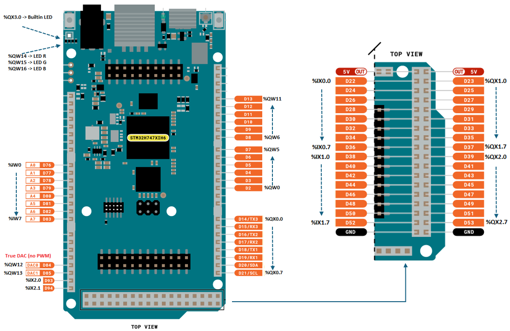
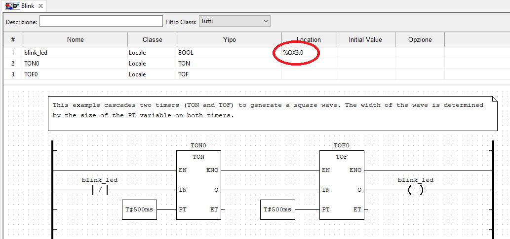
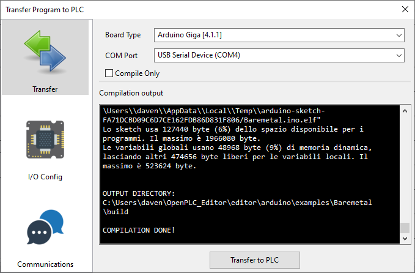
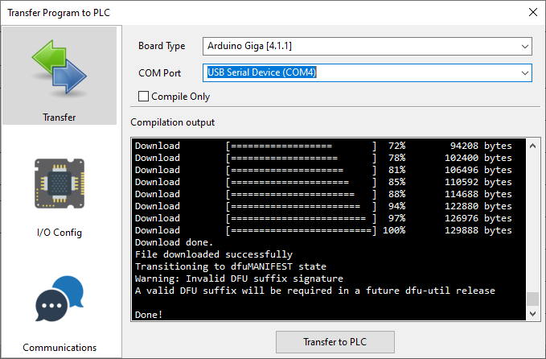

# OpenPLC port for Arduino GIGA R1 WIFI

Arduino GIGA is equipped with the same processor as OPTA and Portenta Machine Control (STM32H747) but is not supported by Arduino PLC IDE.
The (correct) reason is that Arduino GIGA is not industrial hardware.
It is possible, however, for homemade applications, to use OpenPLC. Here you will find the port for Arduino GIGA.

Thanks to the very modular structure of OpenPLC, this operation is very simple and there is nothing to recompile.
1. Copy **giga.cpp** and **giga.hal** into the folder **\OpenPLC_Editor\editor\arduino\src\hal**
2. Edit the file **hals.json** file present into the folder **\OpenPLC_Editor\editor\arduino\examples\Baremetal** by inserting the following item. 

```json
"Arduino Giga": {
    "platform": "arduino:mbed_giga:giga",
    "source": "giga.cpp",
    "version": "0",
    "last_update": 0,
    "core": "arduino:mbed_giga",
    "default_din": "22, 24, 26, 28, 30, 32, 34, 36, 38, 40, 42, 44, 46, 48, 50, 52, 93, 94, 101, 102",
    "default_ain": "A0, A1, A2, A3, A4, A5, A6, A7",
    "default_dout": "14, 15, 16, 17, 18, 19, 20, 21, 23, 25, 27, 29, 31, 33, 35, 37, 39, 41, 43, 45, 47, 49, 51, 53, 87",
    "default_aout": "2, 3, 4, 5, 6, 7, 8, 9, 10, 11, 12, 13, 84, 85, 86, 87, 88",
    "user_din": "22, 24, 26, 28, 30, 32, 34, 36, 38, 40, 42, 44, 46, 48, 50, 52, 93, 94, 101, 102",
    "user_ain": "A0, A1, A2, A3, A4, A5, A6, A7",
    "user_dout": "14, 15, 16, 17, 18, 19, 20, 21, 23, 25, 27, 29, 31, 33, 35, 37, 39, 41, 43, 45, 47, 49, 51, 53, 87",
    "user_aout": "2, 3, 4, 5, 6, 7, 8, 9, 10, 11, 12, 13, 84, 85, 86, 87, 88"
}
```
> Remember that it is a JSON file, so if this item is the last item, you must place a comma at the end of the previous last item.
Or, if you enter this item in the middle, you must insert a comma at the end. 

## Pinout
These are the physical addresses associated with the Arduino GIGA connections



## Note
* The ADC (Analog Inputs) Resolution is set to 16 bit

* The DAC (Analog Outputs) Resolution is set to 12 bit

* Analog Outs A12,A13 (**%QW12, %QW13** -> Pins 84, 85) are **genuine** 12 bits analog ouputs, not PWM.

* Digital Out **%QX3.0** (pin 87) is linked to the built-in led, so it is not suitable as physical out but only for debug purpose.

* Analog Outs **%QW14, %QW15, %QW16** are linked to the RGB LED 

## Test

Due to the LED connection, you can test this port in a very simple way, without having the need of an external hardware.

Open the example **Blink** and modify it setting a physical address to the "**blink_led**" variable, as in figure.



That's all.

Now you can compile the example and transfer it choosing Arduino Giga as target.





## Download tip

When you switch to DFU mode Arduino changes the COM port, and this can be inconvenient if you are using a virtual machine.
If you have problems, use this sequence.

1. Double click on the Arduino GIGA reset button, the LED will start to flash slowly and fade.
2. Reattach the COM to your virtual machine (if it asks you to).
3. Compile the program and transfer it by selecting the COM used at that moment.

## References

<a href="https://autonomylogic.com/" target="_blank">OpenPLC site</a>

<a href="https://github.com/thiagoralves" target="_blank">OpenPLC here</a>